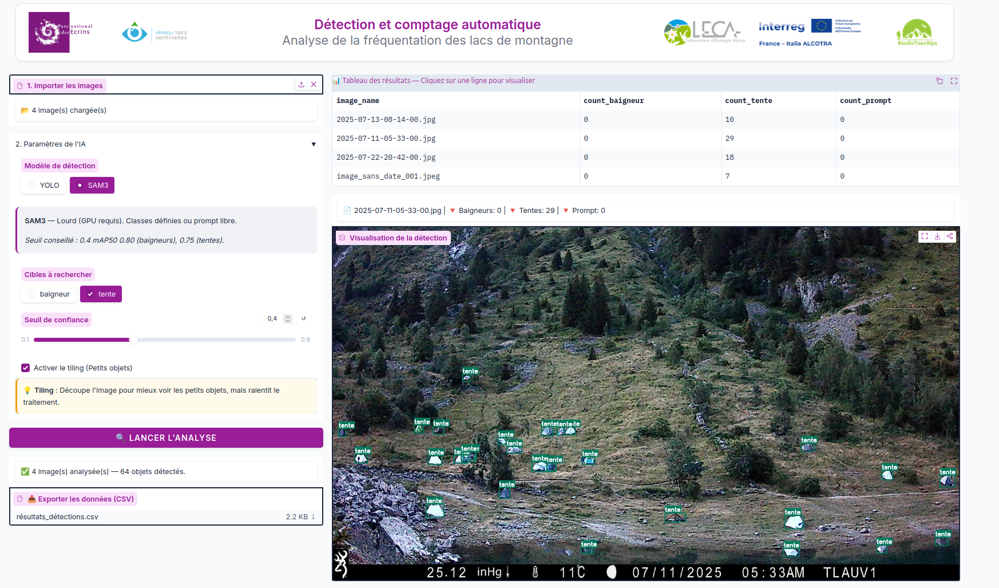

# CAIRN

**CAIRN** est une application web (Gradio) de **détection et de
comptage automatique de la fréquentation** sur les sites naturels de
montagne — lacs d'altitude, zones de bivouac — développée dans le cadre des
projets **PLOUF** et **BiodivTourAlps** (Parc national des Écrins / LECA).

Elle permet d'analyser des séries d'images (issues de caméras
*timelapse*) pour détecter et compter
automatiquement les **baigneurs**, les **tentes** ou autre classes relatives à la fréquentation, à l'aide de modèles
de vision par ordinateur (YOLO, SAM3).




L'interface permet de :
- 📥 **Importer** un lot d'images à analyser
- 🤖 **Choisir** un modèle de détection (YOLO ou SAM3)
- ✅ **Sélectionner** les classes à détecter (tente ou baigneur pour YOLO, prompt libre pour SAM3)
- ⚙️ **Ajuster** les paramètres du modèle (seuil de confiance et tiling optionnel)
- ▶️ **Lancer** l'analyse et consulter les résultats dans un tableau détaillé par image
- 👁️ **Visualiser** les détections (bounding boxes) directement sur les images
- 📤 **Exporter** l'ensemble des résultats au format CSV


➡️ Documentation utilisateur complète : voir
[`docs/guide_utilisateur.md`](docs/guide_utilisateur.md).

## 🚀 Get Started

### Prérequis

- Python ≥ 3.10
- [Git LFS](https://git-lfs.com/) (images d'exemple et poids du modèle YOLO entraîné)
- GPU CUDA recommandé pour SAM3


### Cloner le dépôt et récupérer les poids du modèle YOLO

```bash
git lfs install
git clone https://github.com/PnEcrins/CAIRN.git
cd CAIRN
git lfs pull
```

### Créer un fichier de configuration `config.yaml` (exemple minimal) :

```bash
cp config.yaml.example config.yaml
```

Plus d'informations sur la configuration : [`docs/guide_admin.md`](docs/guide_admin.md).

### Lancer l'application en local (hors Docker)

#### Créer un environnement virtuel et installer les dépendances
```bash
python -m venv .venv
source .venv/bin/activate   # Windows : .venv\Scripts\activate

pip install .
# ou uv sync
```

#### Lancer l'application

```bash
python app.py
```
L'application est servie en local par défaut sur http://127.0.0.1:7860


### Installation via Docker

```bash
docker-compose up -d
```

ou via l'image Docker officielle (GitHub Container Registry) :

```bash
docker run -d -p 80:7860 -v ./config.yaml:/app/config.yaml --name cairn ghcr.io/pnecrins/cairn:latest
```

➡️ Guide pas-à-pas de l'interface : [`docs/guide_utilisateur.md`](docs/guide_utilisateur.md).


## 🧠 Modèles disponibles

| Modèle | Description | Source / article | Téléchargement des poids |
|---|---|---|---|
| **YOLO26** (fine-tuné ) | Détecteur rapide et léger, spécialisé sur les classes `baigneur` / `tente`. Tiling optionnel via SAHI. | [Documentation Ultralytics](https://docs.ultralytics.com/models/yolo26#overview) | Poids fine-tunés versionnés via Git LFS (`CAIRN/models/weights/`) à partir d'un modèle pré-entraîné sur le dataset COCO |
| **SAM3** (Segment Anything Model 3) | Modèle de segmentation/détection par concept (texte), classes prédéfinies ou prompt libre. Ajout d'une fonctionnalité de tilling. | [SAM 3 — docs Ultralytics](https://docs.ultralytics.com/models/sam-3/) | Accès sur demande puis téléchargement manuel via la [page Hugging Face facebook/sam3](https://huggingface.co/facebook/sam3) (fichier `sam3.pt`) |

➡️ Détails (classes, mapping, tiling, licences) : [`docs/modeles.md`](docs/modeles.md).


### Installation du modèle SAM3

SAM3 est un modèle propriétaire (licence non commerciale) et n'est pas inclus dans le dépôt. Pour l'utiliser, il faut :
1. Créer un compte sur [Hugging Face](https://huggingface.co/).
2. Accepter les conditions d'utilisation du modèle SAM3 (licence non commerciale).
3. Télécharger le fichier `sam3.pt` depuis la page [facebook/sam3](https://huggingface.co/facebook/sam3).
4. Placer le fichier `sam3.pt` dans le dossier `CAIRN/model_weights/`.


> [!NOTE]
> Pour les utilisateurs de Docker, il est nécessaire de monter le fichier `sam3.pt` dans le conteneur via un volume Docker (voir exemple dans `docker-compose.yml`) ou d'exécuter la commande docker suivante avec le volume approprié :

```bash
docker run -d -p 80:7860 -v ./config.yaml:/app/config.yaml -v ./model_weights/sam3.pt:/app/model_weights/sam3.pt --name cairn ghcr.io/pnecrins/cairn:latest
``` 

## 🎨 Paramètres

L'apparence de l'application (logos, couleurs, thème, seuils par défaut)
est centralisée en tête de `CAIRN/app.py`.

| Élément | Valeur |
|---|---|
| Couleur baigneur | 🔴 `(239, 51, 64)` |
| Couleur tente | 🟢 `(0, 122, 94)` |
| Couleur prompt libre | 🟠 `(244, 162, 97)` |
| Couleur principale (thème) | `#981d97` (magenta PNE) |
| Police | Inter |
| Seuil de confiance par défaut | `0.4` |
| Seuil de pagination par jour | `100` images |


## 📊 Benchmark

Performances indicatives (validation interne, jeu de données aérien/drone
des lacs de montagne — Anterne, Lauvitel, Muzelle, Pormenaz, Lauzon,
Brevent, Cornu, Jovet) :

| Modèle | Classe | mAP50 | mAP50-95 | Seuil conseillé |
|---|---|---|---|---|
| YOLO |`baigneur` | 0.85 | 0.65 | 0.4 |
| YOLO | `tente` | 0.85 | 0.65 | 0.4 |
| SAM3 | `baigneur` | 0.80 | — | 0.4 |
| SAM3 | `tente` | 0.75 | — | 0.4 |

> Ces chiffres sont indicatifs et dépendent fortement du jeu de données
> d'évaluation, des conditions de prise de vue (altitude, luminosité,
> résolution) et de l'activation ou non du tiling.

## 🙏 Crédits

- **Parc national des Écrins** — pilotage du projet, terrain, charte
  graphique.
- **LECA** (Laboratoire d'Écologie Alpine) — appui scientifique (Vincent Miele).
- **Projets PLOUF & BiodivTourAlps** — financement et cadre des travaux de
  suivi de la fréquentation.

## 📄 Licence

Ce projet est distribué sous licence **AGPL-3.0** — voir [`LICENSE`](LICENSE).

## 📚 Documentation complète

Toute la documentation utilisateur est disponible dans le dossier
[`docs/`](docs/) :


- [Guide utilisateur](docs/guide_utilisateur.md)
- [Guide administrateur](docs/guide_admin.md)

